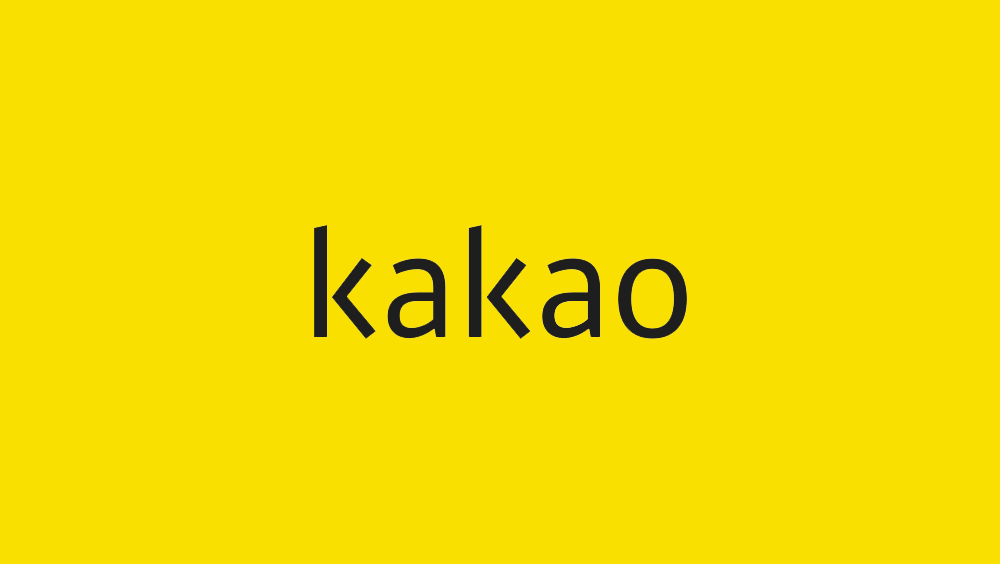

<h1 align="center">챗봇 제작 스터디</h1>

## 챗봇제작 가즈아ㅏㅏㅏㅏ

 

2학년 와서 코딩하는 과목이 없어서 ~~현기증 날것 같아서~~ 코딩에 대한 감도 잃지 않을겸 새로 제작하고 싶던 챗봇을 제작할 예정입니다~

## 참여부원

15학번 김용우 컴퓨터공학과  
17학번 강동민 전자정보통신공학과  
17학번 이동엽 컴퓨터공학과  
18학번 하승원 컴퓨터공학과  
18학번 임수빈 컴퓨터공학과  

## 사용언어

>Node 4.x is End Of Life – April Release Updates (Please Read)

* Node.js®는 Chrome V8 JavaScript 엔진으로 빌드된 JavaScript 런타임입니다.  
* Node.js는 이벤트 기반, 논 블로킹 I/O 모델을 사용해 가볍고 효율적입니다.  
* Node.js의 패키지 생태계인 npm은 세계에서 가장 큰 오픈 소스 라이브러리 생태계이기도 합니다.

## 개발환경 (Cloud 9)

AWS Cloud9은 브라우저만으로 코드를 작성, 실행 및 디버깅할 수 있게 해주는 클라우드 기반 통합 개발 환경(IDE)이며, 코드 편집기, 디버거 및 터미널이 포함되어 있습니다. Cloud9은 JavaScript, Python, PHP를 비롯하여 널리 사용되는 프로그래밍 언어를 위한 필수 도구가 사전에 패키징되어 제공되므로, 새로운 프로젝트를 시작하기 위해 파일을 설치하거나 개발 머신을 구성할 필요가 없습니다.

Download link is [here](https://aws.amazon.com/ko/cloud9/).

## 개발 가이드

1. 회의는 [디스코드](https://discordapp.com/)로 진행합니다.(~~밖에 나가기 싫어서 그런건 아님~~)

2. 사용하는 언어는 Node.js와 JavaScript를 사용합니다.

3. 사용하는 개발툴은 Cloud9 IDE (Amazon Web Service에서 제공하는 클라우드 기반 IDE)

4. 목적은 자바스크립트와 Node.js를 이용해 챗봇을 만들고 더 나아가 자연어 처리와 딥러닝을 이용한 챗봇을 제작한다.

## 개발 순서

1. 자바스크립트 스터디

2. Node.js와 Kakao Talk API를 이용해 제작

3. 딥러닝과 자연어 처리를 통한 매끄러운 챗봇인식을 목표로 합니다.

## 예제 및 강의

* [Git](https://git-scm.com/download/win) 설치및 [Sourcetree](https://www.sourcetreeapp.com/) 연동 [방법](https://blog.naver.com/kooyomi0114/221127863538)
>깃허브는 소스코드 버젼 관리 및 협업 프로그램 입니다. 원래는 git bash를 이용해 사용해야하지만 이방법이 어렵기 때문에 Sourcetree를 사용합니다.

* [Kakao Bot](https://www.slideshare.net/SeongSikChoi/kakao-botplus-friend?qid=e40b4b66-6e53-4e73-af17-6d49ade090dc&v=&b=&from_search=18)
>슬라이드를 만들 당시 카카오 봇은 옐로우 아이디를 이용하여 만들었고, 
현재는 옐로우 아이디가 플러스친구로 바뀌었지만, 챗봇(자동응답)을 만드는 방법은 동일 하기 때문에 별다른 수정없이 업로드합니다.

* [W8(체중관리 챗)](https://www.slideshare.net/SeongSikChoi/w8-77163740)
>카카오와 라인을 기반으로 한 간단한 체중관리 봇

* [Node.js로 카카오봇 만들기](https://cheese10yun.github.io/kakao-bot-node/)
> Node.JS로 카카오봇 만들기
